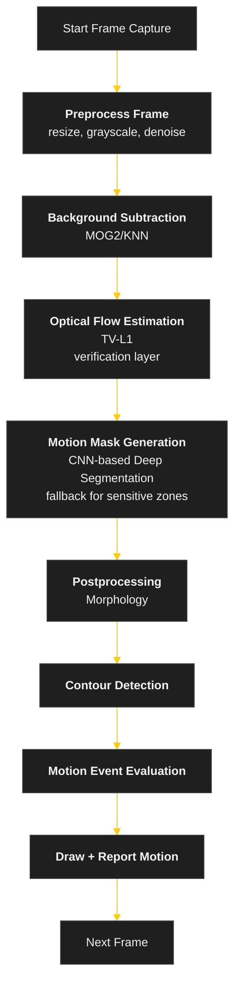
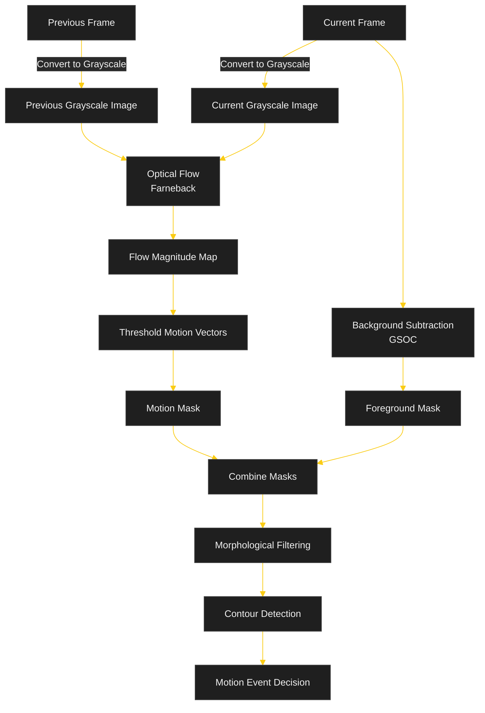
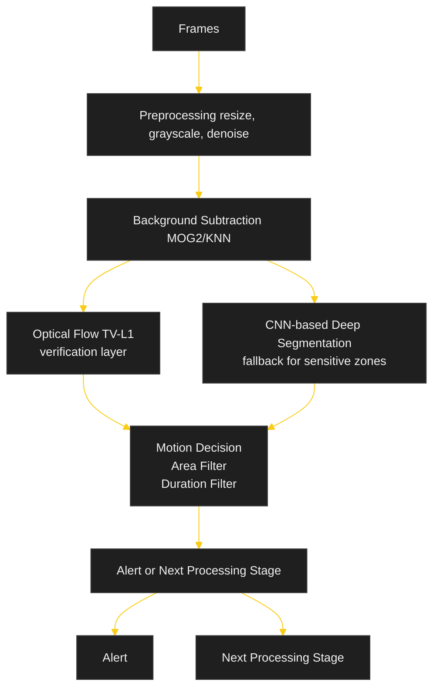
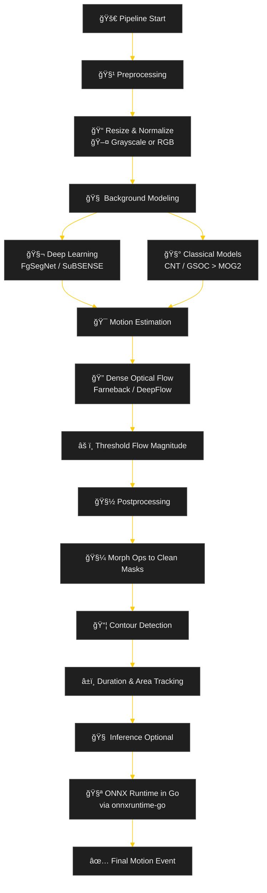

# Motion Detection

## Overview

```mermaid
%%{init: {"theme": "base", "themeVariables": {
  "primaryColor": "#1f1f1f",
  "primaryBorderColor": "#3c3c3c",
  "primaryTextColor": "#f0f0f0",
  "secondaryColor": "#2a2a2a",
  "tertiaryColor": "#444",
  "lineColor": "#facc15",
  "fontSize": "14px"
}}}%%
flowchart TD
    A[Start Frame Capture] --> B[<b>Preprocess Frame</b><br>resize, grayscale, denoise]
    B --> C[<b>Background Subtraction</b><br>MOG2/KNN]
    C --> D[<b>Optical Flow Estimation</b><br>TV-L1<br>verification layer]
    D --> E[<b>Motion Mask Generation</b><br>CNN-based Deep Segmentation<br>fallback for sensitive zones]
    E --> F[<b>Postprocessing</b><br>Morphology]
    F --> G[<b>Contour Detection</b>]
    G --> H[<b>Motion Event Evaluation</b>]
    H --> I[<b>Draw + Report Motion</b>]
    I --> J[Next Frame]
```

## Hybrid Detection Strategy

```mermaid
%%{init: {"theme": "base", "themeVariables": {
  "primaryColor": "#1f1f1f",
  "primaryBorderColor": "#3c3c3c",
  "primaryTextColor": "#f0f0f0",
  "secondaryColor": "#2a2a2a",
  "tertiaryColor": "#444",
  "lineColor": "#facc15",
  "fontSize": "14px"
}}}%%
graph TD
    A[Previous Frame] -->|Convert to Grayscale| B1[Previous Grayscale Image]
    A2[Current Frame] -->|Convert to Grayscale| B2[Current Grayscale Image]
    B1 --> C[Optical Flow<br>Farneback]
    B2 --> C
    C --> D[Flow Magnitude Map]
    D --> E[Threshold Motion Vectors]
    E --> F[Motion Mask]

    A2 --> G[Background Subtraction<br>GSOC]
    G --> H[Foreground Mask]

    F --> I[Combine Masks]
    H --> I
    I --> J[Morphological Filtering]
    J --> K[Contour Detection]
    K --> L[Motion Event Decision]
```

---

## Flowchart

```mermaid
%%{init: {"theme": "base", "themeVariables": {
  "primaryColor": "#1f1f1f",
  "primaryBorderColor": "#3c3c3c",
  "primaryTextColor": "#f0f0f0",
  "secondaryColor": "#2a2a2a",
  "tertiaryColor": "#444",
  "lineColor": "#facc15",
  "fontSize": "14px"
}}}%%
graph TD
    A[Frames] --> B[Preprocessing resize, grayscale, denoise]
    B --> C[Background Subtraction MOG2/KNN]
    C --> D1[Optical Flow TV-L1<br>verification layer]
    C --> D2[CNN-based Deep Segmentation<br>fallback for sensitive zones]
    D1 --> E[Motion Decision<br>Area Filter<br>Duration Filter]
    D2 --> E
    E --> F[Alert or Next Processing Stage]
    F --> G[Alert]
    F --> H[Next Processing Stage]
```

---

```mermaid
%%{init: {"theme": "base", "themeVariables": {
  "primaryColor": "#1f1f1f",
  "primaryBorderColor": "#3c3c3c",
  "primaryTextColor": "#f0f0f0",
  "secondaryColor": "#2a2a2a",
  "tertiaryColor": "#444",
  "lineColor": "#facc15",
  "fontSize": "14px"
}}}%%

graph TD
  A[🚀 Pipeline Start] --> B[🧹 Preprocessing]
  B --> C[📠Resize & Normalize<br>🖤 Grayscale or RGB]
  C --> D[🧠 Background Modeling]
  
  D --> E1[🧬 Deep Learning<br>FgSegNet / SuBSENSE]
  D --> E2[🧰 Classical Models<br>CNT / GSOC > MOG2]

  E1 --> F[🯠Motion Estimation]
  E2 --> F

  F --> G[🔠Dense Optical Flow<br>Farneback / DeepFlow]
  G --> H[âš ï¸ Threshold Flow Magnitude]

  H --> I[🧽 Postprocessing]
  I --> J[🧼 Morph Ops to Clean Masks]
  J --> K[📦 Contour Detection]
  K --> L[â±ï¸ Duration & Area Tracking]

  L --> M[🧠 Inference Optional]
  M --> N[🧪 ONNX Runtime in Go<br>via onnxruntime-go]

  N --> Z[✅ Final Motion Event]
```

