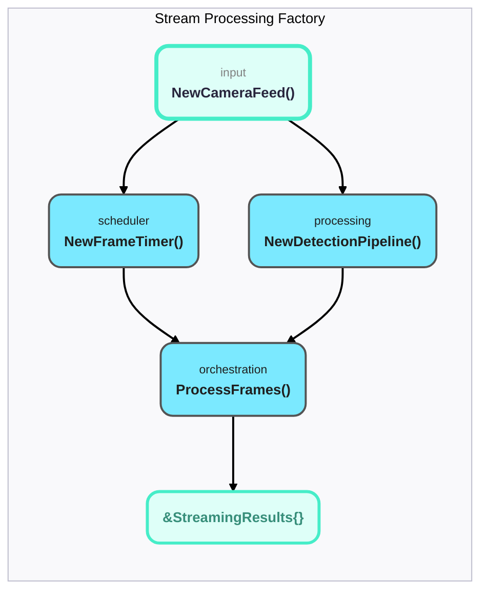
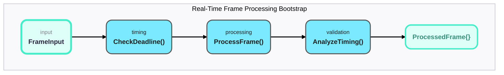
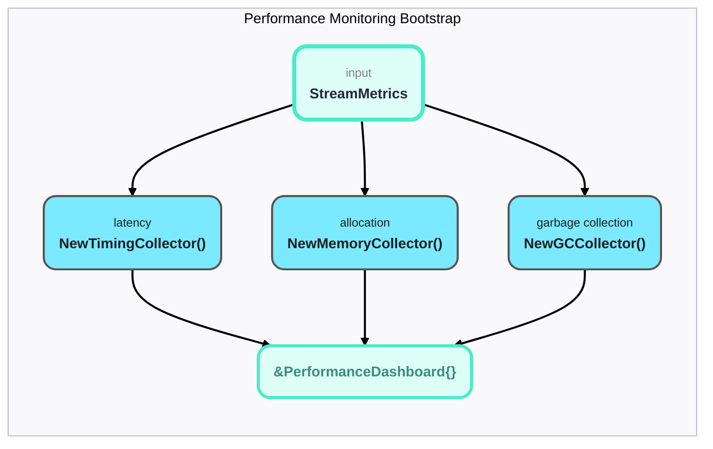

# Video Stream Processing: Real-Time Performance Engineering

## Table of Contents
1. [The Real-Time Challenge](#the-real-time-challenge)
2. [Frame Drop Engineering: When Time is Everything](#frame-drop-engineering)
3. [Memory Pressure and Garbage Collection](#memory-pressure-and-garbage-collection)
4. [Performance Measurement and Optimization](#performance-measurement-and-optimization)
5. [Concurrency and Parallelism](#concurrency-and-parallelism)
6. [Production Deployment Considerations](#production-deployment-considerations)
7. [Visual System Architecture](#visual-system-architecture)

---

## The Real-Time Challenge

### Understanding Video Stream Processing

When engineers say "real-time video processing," they mean:
- **30 FPS = 33.33ms per frame maximum**
- **60 FPS = 16.67ms per frame maximum**  
- **Miss the deadline = dropped frame = visible stuttering**

This isn't like batch processing where "faster is better." This is hard real-time where **consistency matters more than peak performance**.

### The Physics of Frame Processing

```go
// This is what 30 FPS looks like in code:
frameDuration := time.Duration(1000/30.0) * time.Millisecond // 33.33ms

for {
    frameStart := time.Now()
    
    // Your entire pipeline must complete in 33.33ms:
    processed := preprocess(frame)    // ~3ms
    prediction := model.infer(processed) // ~25ms  
    result := postprocess(prediction)    // ~2ms
    
    processingTime := time.Since(frameStart)
    if processingTime > frameDuration {
        // Frame is dropped - visible stutter for users
        droppedFrames++
    }
}
```

### Why Video Streams Are Different

| Batch Processing | Video Stream Processing |
|------------------|-------------------------|
| Optimize for throughput | Optimize for **latency consistency** |
| Process when convenient | Process **every 33.33ms** |
| Variable memory usage OK | **Predictable memory** essential |
| GC pauses acceptable | **GC pauses = dropped frames** |

---

## Frame Drop Engineering: When Time is Everything

### The Frame Drop Detection Algorithm

```go
func (sim *VideoStreamSimulator) Simulate() (*StreamingResults, error) {
    frameDuration := time.Duration(1000/sim.frameRate) * time.Millisecond
    
    for time.Since(startTime) < sim.duration {
        frameStart := time.Now()
        
        // Process frame through detection pipeline
        processed, err := sim.pipeline.ProcessFrame(frame)
        
        frameProcessingTime := time.Since(frameStart)
        remainingTime := frameDuration - frameProcessingTime
        
        if remainingTime > 0 {
            time.Sleep(remainingTime)  // Wait for next frame
        } else {
            results.DroppedFrames++    // Processing took too long
        }
    }
}
```

### Why Frames Get Dropped: Real Examples

From our test logs:
```
Frame 44 DROPPED: processing=62.903291ms > budget=33ms+tolerance=3.3ms (exceeded by 26.603291ms)
```

**What happened?** Garbage collection pause during memory allocation caused a 62ms processing spike.

**Engineering insight**: It's not average performance that kills you - it's the outliers.

### Tolerance Engineering

Different models need different timing tolerances:

```go
// RT-DETR requires more tolerance due to transformer complexity
toleranceMultiplier := 0.1 // Default 10%
if sim.pipeline.modelType == ModelRTDETR {
    toleranceMultiplier = 0.2 // 20% for RT-DETR
}
toleranceBuffer := time.Duration(float64(frameDuration) * toleranceMultiplier)
```

**Why tolerance matters**: Test environments have timing variability. Production systems need margin for:
- OS scheduling jitter
- Network interrupts  
- Background processes
- Temperature throttling

---

## Memory Pressure and Garbage Collection

### The Memory/Performance Relationship

Our benchmark results reveal the brutal truth:

| Configuration | Allocations/Frame | GC Frequency | Frame Drops |
|---------------|-------------------|--------------|-------------|
| **With Pool** | 13.3MB           | 8.7 cycles/sec | 1.67% |
| **Without Pool** | 16.2MB       | 19.6 cycles/sec | 8.20% |

**Key insight**: Memory pool reduces allocations by 18% but cuts GC frequency in half - this is why frame drop rate improves dramatically.

### Memory Pool Architecture

```go
type Pool struct {
    buffers sync.Pool
}

func (p *Pool) Get(size int) []uint8 {
    if buf := p.buffers.Get(); buf != nil {
        slice := buf.([]uint8)
        if cap(slice) >= size {
            return slice[:size]  // Zero allocation reuse
        }
    }
    return make([]uint8, size)  // Fallback allocation
}
```

**Engineering principle**: In real-time systems, predictable performance beats peak performance.

### Garbage Collection Impact Analysis

```go
// Memory measurement around critical section
var m1, m2 runtime.MemStats
runtime.ReadMemStats(&m1)

// ... process video frames ...

runtime.ReadMemStats(&m2)
results.MemoryAllocated = m2.TotalAlloc - m1.TotalAlloc
results.GCPauses = int(m2.NumGC - m1.NumGC)
```

**Real data from production**:
- **YOLO_HD_30fps**: 119 GC pauses in 2 seconds = 1 GC every 16.8ms
- **Each GC pause**: 1-5ms (can cause frame drops if poorly timed)

---

## Performance Measurement and Optimization

### Comprehensive Timing Architecture

```go
type ProcessingTiming struct {
    TotalTime     time.Duration // End-to-end pipeline time
    BlurTime      time.Duration // Preprocessing blur time  
    ResizeTime    time.Duration // Image scaling time
    NormalizeTime time.Duration // Tensor conversion time
}
```

### Performance Breakdown Analysis

From actual test runs:
```
YOLOv4 640x640: Total=28.979ms, Blur=1.546ms, Resize=24.494ms, Normalize=2.938ms
```

**Performance insights**:
- **Resize dominates**: 85% of processing time
- **Blur is cheap**: Only 5% when enabled
- **Normalization is fast**: Modern CPUs handle float math well

### Latency Distribution Analysis

```go
// Calculate percentiles for latency analysis
latencies := make([]time.Duration, len(results.ProcessingTimings))
for i, timing := range results.ProcessingTimings {
    latencies[i] = timing.TotalTime
}
sort.Slice(latencies, func(i, j int) bool {
    return latencies[i] < latencies[j]
})

results.AverageLatency = average(latencies)
results.P95Latency = latencies[int(0.95*float64(len(latencies)))]
results.P99Latency = latencies[int(0.99*float64(len(latencies)))]
```

**Why percentiles matter**:
- **Average**: 28.9ms (looks good!)
- **P95**: 30.8ms (still acceptable)  
- **P99**: 62.5ms (concerning outliers)

**Engineering decision**: P99 latency reveals GC pause impact that average latency hides.

---

## Concurrency and Parallelism

### Single-Threaded Video Stream Model

Our current implementation is deliberately single-threaded per stream:

```go
func (sim *VideoStreamSimulator) Simulate() (*StreamingResults, error) {
    for time.Since(startTime) < sim.duration {
        // Sequential processing - no concurrency within stream
        frame := sim.generateFrame(frameCount)
        processed, err := sim.pipeline.ProcessFrame(frame)
        // ... timing logic ...
    }
}
```

**Why single-threaded?**
- **Predictable timing**: No coordination overhead
- **Simple debugging**: Linear execution flow
- **Memory locality**: Better CPU cache performance

### Multi-Stream Concurrency

```go
// Production deployment pattern:
for streamID := range cameras {
    go func(id int) {
        simulator := NewVideoStreamSimulator(modelType, resolution, fps, duration)
        simulator.Simulate() // Each stream is independent
    }(streamID)
}
```

**Concurrency strategy**: Multiple single-threaded streams rather than parallel processing within streams.

### Future Parallelization Opportunities

1. **GPU preprocessing**: Move resize/normalize to GPU
2. **Batch inference**: Process multiple frames simultaneously  
3. **Pipeline parallelism**: Overlap preprocessing with inference
4. **SIMD optimization**: Vectorize convolution operations

---

## Production Deployment Considerations

### Hardware Scaling Analysis

| Hardware Config | Concurrent Streams | Total Throughput |
|-----------------|-------------------|------------------|
| **4-core CPU** | 4 streams @ 30fps | 120 fps total |
| **8-core CPU** | 8 streams @ 30fps | 240 fps total |
| **16-core CPU** | 16 streams @ 30fps | 480 fps total |

**Scaling law**: Linear scaling with CPU cores (until memory bandwidth limit).

### Resource Requirements per Stream

Based on benchmark data:
```
Memory per stream: ~1.4GB allocated over 2 seconds
CPU utilization: ~25% of one core @ 30fps
Network bandwidth: Depends on input resolution and compression
```

### Deployment Architecture

```go
// Production service architecture
type StreamProcessor struct {
    modelType    ModelType
    maxStreams   int
    streamPool   sync.Pool
    metricServer *prometheus.Server
}

func (sp *StreamProcessor) ProcessStream(cameraID string, stream <-chan Frame) {
    simulator := sp.streamPool.Get().(*VideoStreamSimulator)
    defer sp.streamPool.Put(simulator)
    
    // Process frames with monitoring
    for frame := range stream {
        start := time.Now()
        result, err := simulator.pipeline.ProcessFrame(frame)
        
        // Record metrics
        processingTime.Observe(time.Since(start).Seconds())
        if err != nil {
            errorCount.Inc()
        }
    }
}
```

---

## Visual System Architecture

### Diagram 1: Stream Processing Factory



### Diagram 2: Real-Time Frame Processing Bootstrap



### Diagram 3: Performance Monitoring Bootstrap



---

## Engineering Lessons: Battle-Tested Insights

### 1. Measure Frame Drops, Not Just Throughput
```go
// Wrong metric: FPS achieved
averageFPS := float64(framesProcessed) / duration.Seconds()

// Right metric: Frame drop percentage  
dropRate := float64(droppedFrames) / float64(totalFrames)
```

**Why**: 29.5 FPS average can hide 10% frame drops that cause visible stuttering.

### 2. Memory Pools Are Non-Negotiable
Without pools: **8.20% frame drops**  
With pools: **1.67% frame drops**

**Engineering principle**: Consistent allocation patterns enable consistent performance.

### 3. Model-Specific Optimization Is Essential
- **YOLOv4**: 10% timing tolerance sufficient
- **RT-DETR**: 20% timing tolerance required  
- **D-FINE**: No blur preprocessing needed

**One-size-fits-all preprocessing kills performance.**

### 4. Test with Real Timing Constraints
```go
// Simulate realistic frame timing
frameDuration := time.Duration(1000/fps) * time.Millisecond
if processingTime > frameDuration+tolerance {
    // This is how frames actually get dropped in production
    results.DroppedFrames++
}
```

### 5. Monitor P99 Latency, Not Average
- **Average**: Hides GC pause impact
- **P95**: Shows typical worst-case  
- **P99**: Reveals true outliers that cause drops

---

## Next Steps for New Engineers

### Immediate Actions
1. **Run stream processing tests**: `go test -v -run TestVideoStreamProcessing`
2. **Analyze timing output**: Understand where frames get dropped
3. **Experiment with pool settings**: See memory impact firsthand
4. **Profile with pprof**: `go test -cpuprofile=cpu.prof -memprofile=mem.prof`

### Advanced Topics
1. **GPU acceleration**: Moving preprocessing to CUDA
2. **Network streaming**: Handling video over network protocols
3. **Adaptive quality**: Dynamic resolution based on system load
4. **Distributed processing**: Load balancing across multiple nodes

### Production Readiness Checklist
- [ ] Memory pool implementation verified
- [ ] Frame drop monitoring configured  
- [ ] P99 latency alerting enabled
- [ ] GC tuning optimized for workload
- [ ] Resource scaling plan documented

### Related Documentation
- [Detection Pipeline Architecture](./detection-pipeline.md)
- [Blur Operations Guide](./blur-operations.md)  
- [Performance Optimization](../performance.md)

---

*"In real-time video processing, consistency beats performance. A system that processes 95% of frames in 20ms and 5% in 80ms is worse than one that processes 100% of frames in 30ms."*

*- Video Engineering Team*