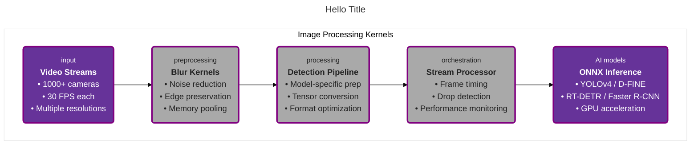

The imaging facility provides the image processing kernels system.

```mermaid
---
title: Hello Title
config:
  theme: base
  themeVariables:
    primaryColor: white
    primaryBorderColor: purple
    lineColor: 
---
flowchart TD
  classDef start stroke-width: 3px, fill: rebeccapurple, color: white
  classDef main stroke-width: 3px, fill: darkgrey, color: #222
  classDef return stroke-width:3px, fill: rebeccapurple, color: white

  subgraph system_overview["Image Processing Kernels"]

    video_input@{label: "<span style=\"color: gray; font-size: smaller\">input</span><br><b>Video Streams</b><br>• 1000+ cameras<br>• 30 FPS each<br>• Multiple resolutions"}
    video_input@{shape: rounded}
    class video_input start

    video_input --> blur_kernel
    blur_kernel@{label: "<span style=\"color: gray; font-size: smaller\">preprocessing</span><br><b>Blur Kernels</b><br>• Noise reduction<br>• Edge preservation<br>• Memory pooling"}
    blur_kernel@{shape: rounded}
    class blur_kernel main

    blur_kernel --> detection_pipeline
    detection_pipeline@{label: "<span style=\"color: gray; font-size: smaller\">processing</span><br><b>Detection Pipeline</b><br>• Model-specific prep<br>• Tensor conversion<br>• Format optimization"}
    detection_pipeline@{shape: rounded}
    class detection_pipeline main

    detection_pipeline --> stream_processor
    stream_processor@{label: "<span style=\"color: gray; font-size: smaller\">orchestration</span><br><b>Stream Processor</b><br>• Frame timing<br>• Drop detection<br>• Performance monitoring"}
    stream_processor@{shape: rounded}
    class stream_processor main

    stream_processor --> ai_inference
    ai_inference@{label: "<span style=\"color: gray; font-size: smaller\">AI models</span><br><b>ONNX Inference</b><br>• YOLOv4 / D-FINE<br>• RT-DETR / Faster R-CNN<br>• GPU acceleration"}
    ai_inference@{shape: rounded}
    class ai_inference return
  end
```
