# Image Processing Kernels: Complete Engineering Guide

The image processing kernels system provides implementation for imaging operations and algorithms required
throughout the video analytics pipeline for nvr.ai.

## Table of Contents

1. [Blur Operations](./blur-operations.md)
2. [Pipeline Architecture](./detection-pipeline.md)
3. [Video Stream Processing](./video-stream-processing.md)


### Blur Operations

See the documentation for [Blur Operations](./blur-operations.md) that covers:

1. Mathematical foundations of convolution.
2. Memory pool architecture.
3. Performance optimization strategies.

### Pipeline Architecture

See the documentation for [Pipeline Architecture](./detection-pipeline.md) that covers:

1. Model-specific optimizations (YOLO, D-FINE, RT-DETR, Faster R-CNN).
2. Format standardization challenges.
3. Tensor conversion details.

See the documentation for [Video Stream Processing](./video-stream-processing.md) that covers:

1. Frame drop engineering with actual test data.
2. Memory pressure and GC impact analysis.
3. Timing tolerance strategies.
4. 3 detailed mermaid diagrams (timeline, architecture, monitoring).


## Engineering Insights Documented

The image kernel system handles different detection models with tailored optimization strategies:

| Strategy  | Model        | Description                                                      |
| --------- | ------------ | ---------------------------------------------------------------- |
| Speed     | YOLOv4       | Minimal blur radius of 1 and standard ImageNet normalization.    |
| Accuracy  | D-FINE       | No blurring and simple scaling.                                  |
| Accuracy  | Faster R-CNN | No blurring and simple scaling.                                  |
| Tolerance | RT-DETR      | Extended timing tolerance of 20% (compared to the standard 10%). |

Real-world testing shows that memory pooling reduces garbage collection frequency by 56% (from 19.6 to 8.7 GC/sec), while frame drop rates decrease from 8.20% to 1.67%, enabling smooth video processing even under memory pressure.

Frame drop analysis reveals precise timing breakdowns, such as Frame 44 exceeding its 33ms budget by 26.6ms due to processing spikes, providing actionable insights for performance tuning and capacity planning for future iterations.

Frame Drop Analysis

Frame 44 DROPPED: processing=62.903291ms > budget=33ms+tolerance=3.3ms (exceeded by 26.603291ms)

- Explains exactly why frames drop (GC pauses, processing spikes)
- Shows tolerance engineering for different models
- Real performance data from test suite

Memory Pool Impact

- With Pools: 13.3MB/frame, 8.7 GC/sec, 1.67% drops
- Without Pools: 16.2MB/frame, 19.6 GC/sec, 8.20% drops
- 56% reduction in GC frequency = smooth video processing

Model-Specific Optimizations

- **YOLOv4** is speed-optimized (blur radius=1, ImageNet normalization).
- **D-FINE** is accuracy-optimized (no blur, simple scaling).
- **RT-DETR** is tolerance-optimized (20% timing tolerance vs 10%).
- **Faster R-CNN** is accuracy-optimized (no blur, simple scaling).

## 🎯 Learning Path for New Engineers

### Phase 1: Foundations (Week 1)

**Goal**: Understand the core concepts and run your first tests

1. **Start Here**: [Blur Operations Guide](./blur-operations.md)

   - Learn why blur exists in computer vision
   - Understand convolution mathematics
   - Run basic blur tests: `go test -v ./blur_test.go`

1. **Next**: [Detection Pipeline Architecture](./detection-pipeline.md)

   - See how blur fits into the bigger picture
   - Understand preprocessing → inference → postprocessing
   - Run pipeline tests: `go test -v ./integration_test.go`

1. **Finally**: [Video Stream Processing](./video-stream-processing.md)

   - Learn real-time constraints and frame drops
   - Understand memory pools and GC pressure
   - Run stream tests: `go test -v -run TestVideoStreamProcessing`

### Phase 2: Deep Dive (Week 2-3)

**Goal**: Understand implementation details and optimization strategies

4. **Performance Analysis**:

   - Study timing breakdowns from test output
   - Analyze memory allocation patterns
   - Understand P99 latency implications

5. **Code Deep Dive**:

   ```bash
   # Key files to study:
   images/kernels/copilot.go          # Main blur API
   images/kernels/integration_test.go  # Pipeline simulation
   images/kernels/benchmark_test.go   # Performance tests
   ```

6. **Experimentation**:

   - Modify blur radius settings
   - Try different model configurations
   - Profile with `go tool pprof`

### Phase 3: Production Readiness (Week 4)

**Goal**: Understand deployment and monitoring

7. **Production Considerations**:

   - Memory pool strategies
   - Frame drop monitoring
   - Multi-stream scaling

8. **Advanced Topics**:

   - GPU acceleration opportunities
   - SIMD optimization potential
   - Batch processing strategies

---

## 🏗️ System Architecture Overview

```mermaid
---
displayMode: compact
config:
  theme: redux
---
flowchart LR
  classDef start stroke-width:4px, stroke:#46EDC8, fill:#DEFFF8
  classDef main stroke:#545454, stroke-width:2px, fill:#7BE9FF, color:#1F1F1F
  classDef return stroke-width:3px, stroke:#46EDC8, fill:#DEFFF8, color:#378E7A

  subgraph system_overview["Image Processing Kernels System"]

    video_input@{label: "<span style=\"color: gray; font-size: smaller\">input</span><br><b>Video Streams</b><br>• 1000+ cameras<br>• 30 FPS each<br>• Multiple resolutions"}
    video_input@{shape: rounded}
    class video_input start

    video_input --> blur_kernel
    blur_kernel@{label: "<span style=\"color: gray; font-size: smaller\">preprocessing</span><br><b>Blur Kernels</b><br>• Noise reduction<br>• Edge preservation<br>• Memory pooling"}
    blur_kernel@{shape: rounded}
    class blur_kernel main

    blur_kernel --> detection_pipeline
    detection_pipeline@{label: "<span style=\"color: gray; font-size: smaller\">processing</span><br><b>Detection Pipeline</b><br>• Model-specific prep<br>• Tensor conversion<br>• Format optimization"}
    detection_pipeline@{shape: rounded}
    class detection_pipeline main

    detection_pipeline --> stream_processor
    stream_processor@{label: "<span style=\"color: gray; font-size: smaller\">orchestration</span><br><b>Stream Processor</b><br>• Frame timing<br>• Drop detection<br>• Performance monitoring"}
    stream_processor@{shape: rounded}
    class stream_processor main

    stream_processor --> ai_inference
    ai_inference@{label: "<span style=\"color: gray; font-size: smaller\">AI models</span><br><b>ONNX Inference</b><br>• YOLOv4 / D-FINE<br>• RT-DETR / Faster R-CNN<br>• GPU acceleration"}
    ai_inference@{shape: rounded}
    class ai_inference return
  end
```



---

## 📊 Performance Characteristics

### Processing Time Breakdown

| Component       | Time (ms) | Percentage | Optimization Potential |
| --------------- | --------- | ---------- | ---------------------- |
| **Blur**        | 2-3ms     | 7%         | ✅ Already optimized   |
| **Resize**      | 22-24ms   | 79%        | 🔄 Primary target      |
| **Normalize**   | 3ms       | 11%        | ✅ Already optimized   |
| **Memory Mgmt** | 1-2ms     | 3%         | ✅ Pool optimized      |

### Memory Impact Analysis

| Configuration     | Allocation/Frame | GC Frequency | Frame Drops |
| ----------------- | ---------------- | ------------ | ----------- |
| **With Pools**    | 13.3MB           | 8.7/sec      | 1.67%       |
| **Without Pools** | 16.2MB           | 19.6/sec     | 8.20%       |
| **Improvement**   | -18%             | -56%         | -75%        |

### Model Performance Comparison

| Model            | Avg Latency | P95 Latency | Drop Rate | Tolerance |
| ---------------- | ----------- | ----------- | --------- | --------- |
| **YOLOv4**       | 29.0ms      | 30.8ms      | 3.39%     | 10%       |
| **D-FINE**       | 26.4ms      | 27.4ms      | 0.00%     | 10%       |
| **RT-DETR**      | 28.9ms      | 30.1ms      | 0.00%     | 20%       |
| **Faster R-CNN** | 29.5ms      | 30.9ms      | 0.00%     | 10%       |

---

## 🎯 Key Engineering Principles

### 1. Real-Time First

- **30 FPS = 33.33ms deadline per frame**
- Consistency matters more than peak performance
- Frame drops cause visible stuttering

### 2. Memory Management is Performance

- Allocation patterns directly impact frame drops
- Memory pools reduce GC pressure by 56%
- Predictable allocation enables predictable performance

### 3. Model-Specific Optimization

- No "one-size-fits-all" preprocessing
- Each model has optimal configuration
- RT-DETR needs 20% more timing tolerance

### 4. Measure Everything

```go
// Essential metrics for real-time video:
type StreamingResults struct {
    FramesProcessed   int           // Total throughput
    DroppedFrames     int           // Quality metric
    AverageLatency    time.Duration // Typical performance
    P95Latency        time.Duration // Worst-case performance
    P99Latency        time.Duration // Outlier detection
    MemoryAllocated   uint64        // Resource usage
    GCPauses          int           // System pressure
}
```

### 5. Test with Real Constraints

- Simulate actual frame timing
- Include memory pressure scenarios
- Test with production-like loads

---

## 🔧 Getting Started: Hands-On Tutorial

### Step 1: Environment Setup

```bash
# Navigate to the kernels directory
cd /Users/matthewdavis/workspace/nvr.ai/lab/go-ml/images/kernels

# Verify Go environment
go version  # Should be 1.24.2+

# Install dependencies
go mod tidy
```

### Step 2: Run Basic Tests

```bash
# Test blur operations
go test -v ./blur_test.go
# ✅ Should see accuracy validation across different scenarios

# Test detection pipeline
go test -v ./integration_test.go -run TestDetectionPipelineIntegration
# ✅ Should see timing breakdown for each model

# Test video stream processing
go test -v ./integration_test.go -run TestVideoStreamProcessing
# ✅ Should see frame drop analysis with detailed logging
```

### Step 3: Analyze Performance

```bash
# Run with detailed timing
go test -v ./integration_test.go -run TestVideoStreamProcessing

# Look for output like:
# Frame 44 DROPPED: processing=62.903291ms > budget=33ms+tolerance=3.3ms (exceeded by 26.603291ms)
# YOLO_HD_30fps Results:
#   Frames: 60 processed, 3 dropped (5.00%)
#   Drop Details: Frame processing exceeded 33ms budget + 10% tolerance
```

### Step 4: Experiment with Configuration

```go
// Try modifying blur settings in integration_test.go:
case ModelYOLOv4:
    pipeline.BlurOptions = Options{Radius: 3}  // Increase from 1 to 3
    // Run tests to see performance impact

case ModelDFINE:
    pipeline.BlurEnabled = true  // Enable blur for D-FINE
    // See how this affects accuracy vs speed
```

### Step 5: Profile Performance

```bash
# Generate CPU profile
go test -cpuprofile=cpu.prof -run TestVideoStreamProcessing

# Generate memory profile
go test -memprofile=mem.prof -run TestVideoStreamProcessing

# Analyze profiles
go tool pprof cpu.prof
go tool pprof mem.prof
```

---

## 🏭 Production Deployment Guide

### Scaling Calculations

```go
// Resource planning for production deployment:
const (
    CamerasPerYear     = 1000           // Growth rate
    FPSPerCamera      = 30              // Frame rate
    ProcessingTimePer = 30 * time.Millisecond  // Per frame
    CoreCount         = 700             // Available cores
    MemoryPerStream   = 1.4             // GB allocated per 2 seconds
)

// Maximum concurrent streams:
maxStreams := CoreCount * (1000 / int(ProcessingTimePer/time.Millisecond))
// = 700 * (1000/30) = ~23,333 streams possible
```

### Monitoring Setup

```go
// Essential production metrics:
type ProductionMetrics struct {
    StreamsActive     prometheus.Gauge     // Current load
    FramesProcessed   prometheus.Counter   // Throughput
    FramesDropped     prometheus.Counter   // Quality
    ProcessingLatency prometheus.Histogram // Performance
    MemoryUsage       prometheus.Gauge     // Resources
    GCPauses          prometheus.Counter   // System health
}
```

### Alert Thresholds

- **Frame drop rate > 5%**: Performance degradation
- **P99 latency > 50ms**: System overload
- **Memory growth > 10%/hour**: Potential leak
- **GC frequency > 20/sec**: Memory pressure

---

## 🔬 Advanced Topics

### GPU Acceleration Opportunities

```go
// Current CPU bottlenecks suitable for GPU:
// 1. Bilinear resize (79% of processing time)
// 2. Convolution operations (blur kernels)
// 3. Tensor format conversion (NCHW layouts)

// Potential CUDA implementation:
func GPUResize(src *image.RGBA, target image.Point) *image.RGBA {
    // cuBLAS-accelerated bilinear interpolation
    // Expected 10x speedup for large images
}
```

### SIMD Optimization

```go
// Vectorization opportunities:
// - Process 4 pixels simultaneously with AVX2
// - Blur convolution can use FMA instructions
// - Tensor normalization benefits from vector math

// Example SIMD blur (pseudo-code):
func SIMDBoxBlur(src []uint8, width, height, radius int) []uint8 {
    // Use AVX2 intrinsics for 8-pixel parallel processing
    // Expected 4x speedup on modern CPUs
}
```

### Batch Processing

```go
// Process multiple frames simultaneously:
type BatchProcessor struct {
    batchSize    int
    inputFrames  []image.Image
    outputTensor []float32  // Batched NCHW format
}

// Benefits:
// - Better GPU utilization
// - Amortized preprocessing cost
// - Higher throughput for offline processing
```

---

## 📚 Related Documentation

### Core Documentation

- [ONNX Runtime Integration](onnx.md)
- [Performance Optimization Guide](../performance.md)
- [Development Workflow](development.md)

### API Reference

- [Blur Operations API](./blur-operations.md#api-reference)
- [Detection Pipeline API](./detection-pipeline.md#api-reference)
- [Stream Processing API](./video-stream-processing.md#api-reference)

### Architecture Documents

- [Engine Factory Overview](../diagrams/engine.mmd)
- [Model Export Process](export.md)
- [Motion Detection System](motion-detection.md)

---

## 🤝 Contributing and Support

### Getting Help

- **Slack**: #cv-engineering channel
- **Issues**: GitHub repository issues
- **Documentation**: This guide and linked resources
- **Code Reviews**: Required for all changes

### Engineering Standards

- **Test Coverage**: 100% for critical paths
- **Performance**: No regressions without justification
- **Documentation**: Update guides with architectural changes
- **Monitoring**: Add metrics for new features

### Next Engineering Projects

1. **GPU Preprocessing Pipeline**: Move resize to CUDA
2. **Adaptive Quality System**: Dynamic resolution based on load
3. **Multi-Model Batch Processing**: Optimize for inference servers
4. **SIMD Optimization**: Vectorize convolution operations

---

_"The best real-time system is one where you never notice the engineering - frames just flow, consistently, every 33.33 milliseconds."_

_- Computer Vision Engineering Team_

---

## Quick Reference

| Topic                     | File                                                       | Key Concept                      |
| ------------------------- | ---------------------------------------------------------- | -------------------------------- |
| **Blur Math**             | [blur-operations.md](./blur-operations.md)                 | Convolution & edge handling      |
| **Pipeline Flow**         | [detection-pipeline.md](./detection-pipeline.md)           | Preprocess → infer → postprocess |
| **Real-time Constraints** | [video-stream-processing.md](./video-stream-processing.md) | 33.33ms deadline per frame       |
| **Code Entry Point**      | `copilot.go`                                               | Main blur API                    |
| **Test Suite**            | `integration_test.go`                                      | Pipeline simulation              |
| **Performance Tests**     | `benchmark_test.go`                                        | Memory & timing analysis         |
