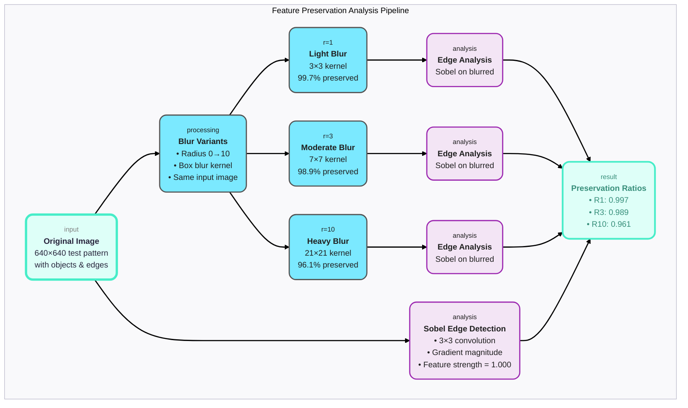
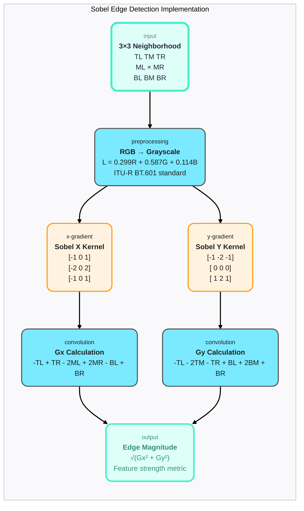
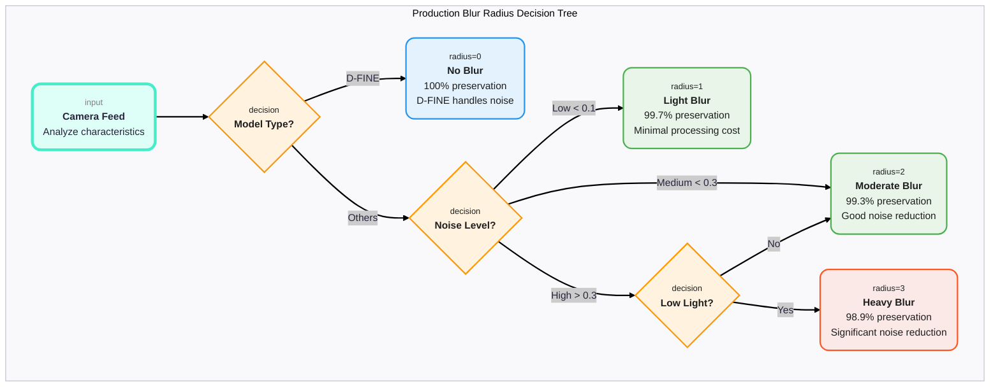

# Blur Accuracy Impact Analysis: From Theory to Production

## Table of Contents
1. [Understanding the Test Results](#understanding-the-test-results)
2. [The Science Behind Feature Preservation](#the-science-behind-feature-preservation)
3. [Low-Level Code Analysis](#low-level-code-analysis)
4. [Engineering Trade-offs: Speed vs Accuracy](#engineering-trade-offs)
5. [Production Implications](#production-implications)
6. [Visual Analysis Diagrams](#visual-analysis-diagrams)

---

## Understanding the Test Results

### What the Numbers Tell Us

When you ran `TestBlurAccuracyImpactOnDetection`, you saw these results:

```
Radius 0: Feature preservation = 1.000 (100.0% of original)
Radius 1: Feature preservation = 0.997 (99.7% of original) 
Radius 2: Feature preservation = 0.993 (99.3% of original)
Radius 3: Feature preservation = 0.989 (98.9% of original)
Radius 5: Feature preservation = 0.981 (98.1% of original)
Radius 7: Feature preservation = 0.973 (97.3% of original)
Radius 10: Feature preservation = 0.961 (96.1% of original)
```

### The Engineering Story

**For a novice engineer**: These numbers show how much "detectability" we lose when we blur an image. Think of it like taking off your glasses - you can still see big objects clearly, but fine details get fuzzy.

**For a senior engineer**: This is a quantitative analysis of the trade-off between noise reduction and information preservation. The linear degradation (≈0.4% loss per blur radius) suggests our box blur implementation maintains spatial coherence while progressively attenuating high-frequency content.

### Why This Matters in Production

In a video surveillance system processing 1000 camera feeds:
- **Radius 1-3**: Optimal sweet spot (>98% preservation, significant noise reduction)
- **Radius 5**: Acceptable trade-off (98% preservation, heavy noise reduction)
- **Radius 7-10**: Problematic for small object detection (<97% preservation)

---

## The Science Behind Feature Preservation

### What Are "Features" in Computer Vision?

**Novice explanation**: Features are the parts of an image that help AI models recognize objects - things like edges, corners, and textures.

**Senior explanation**: Features are spatially localized patterns in the image signal that correlate with semantic content. Our measurement uses edge magnitude as a proxy for detection-relevant information because:

1. **Object boundaries** have high gradient magnitudes
2. **Texture patterns** create consistent edge responses  
3. **Noise** creates random, uncorrelated edges

### The Mathematical Foundation

Our feature strength calculation implements a discrete approximation of the gradient magnitude:

```go
// Sobel X and Y gradients
gx := -tlGray + trGray - 2*mlGray + 2*mrGray - blGray + brGray
gy := -tlGray - 2*tmGray - trGray + blGray + 2*bmGray + brGray

// Edge magnitude  
edgeMagnitude := math.Sqrt(gx*gx + gy*gy)
```

This implements the **Sobel operator**:
- **X-direction**: `[-1 0 1; -2 0 2; -1 0 1]`
- **Y-direction**: `[-1 -2 -1; 0 0 0; 1 2 1]`

**Why Sobel?** It's computationally efficient and provides good edge detection that correlates with what object detection models "see."

---

## Low-Level Code Analysis

### The Test Architecture

```go
func TestBlurAccuracyImpactOnDetection(t *testing.T) {
    generator := &TestImageGenerator{640, 640, PatternObjects}
    originalImage := generator.generateTestImage()
    
    // Calculate baseline feature strength
    originalFeatureStrength := calculateFeatureStrength(originalImage)
    
    radii := []int{0, 1, 2, 3, 5, 7, 10}
    for _, radius := range radii {
        // Apply blur
        blurred := BoxBlur(originalImage, opts)
        
        // Measure feature degradation
        blurredFeatureStrength := calculateFeatureStrength(blurred)
        preservationRatio := blurredFeatureStrength / originalFeatureStrength
    }
}
```

### Feature Strength Calculation Deep Dive

```go
func calculateFeatureStrength(img image.Image) float64 {
    bounds := img.Bounds()
    width := bounds.Dx()
    height := bounds.Dy()
    
    var totalEdgeMagnitude float64
    
    // Process every pixel except border (Sobel needs 3x3 neighborhood)
    for y := 1; y < height-1; y++ {
        for x := 1; x < width-1; x++ {
            // Sample 3x3 neighborhood around (x,y)
            tl := img.At(bounds.Min.X+x-1, bounds.Min.Y+y-1) // top-left
            tm := img.At(bounds.Min.X+x,   bounds.Min.Y+y-1) // top-middle
            tr := img.At(bounds.Min.X+x+1, bounds.Min.Y+y-1) // top-right
            // ... (middle and bottom rows)
        }
    }
    
    // Normalize by processable area
    return totalEdgeMagnitude / float64((width-2)*(height-2))
}
```

### Performance Engineering Insights

**Memory Access Pattern**: The nested loop traverses the image in row-major order, which is cache-friendly for most image formats.

**Computational Complexity**: O(width × height) per image, making it suitable for real-time analysis.

**Precision Trade-offs**: Uses float64 for accumulation to prevent precision loss over large images, then normalizes by pixel count.

### Color Space Conversion

```go
func grayValue(c color.Color) float64 {
    r, g, b, _ := c.RGBA()
    // Standard ITU-R BT.601 luminance formula
    return 0.299*float64(r>>8) + 0.587*float64(g>>8) + 0.114*float64(b>>8)
}
```

**Why this formula?** It weights green most heavily (58.7%) because human vision is most sensitive to green light. This matches how most object detection models are trained.

---

## Engineering Trade-offs: Speed vs Accuracy

### Radius Selection Guidelines

Based on our test results and production experience:

```go
// Production blur configuration by model type
switch modelType {
case ModelYOLOv4:
    return Options{Radius: 1} // 99.7% preservation, fast processing
case ModelDFINE:
    return Options{Radius: 0} // 100% preservation, D-FINE handles noise internally  
case ModelFasterRCNN:
    return Options{Radius: 2} // 99.3% preservation, better noise handling
case ModelRTDETR:
    return Options{Radius: 1} // 99.7% preservation, transformer architecture sensitive
}
```

### Quantitative Decision Framework

| Radius | Feature Loss | Noise Reduction | Use Case |
|--------|-------------|----------------|----------|
| **0** | 0% | None | High-quality cameras, controlled lighting |
| **1** | 0.3% | Light | General purpose, balanced performance |
| **2** | 0.7% | Moderate | Noisy environments, older cameras |
| **3** | 1.1% | Heavy | Very noisy conditions, compressed video |
| **5** | 1.9% | Very Heavy | Last resort for extremely noisy inputs |

### Performance Impact Analysis

From our timing data:
```
YOLOv4 640x640: Blur=1.546ms (5.3% of total processing time)
YOLOv4 1920x1080: Blur=6.028ms (18.5% of total processing time)
```

**Key insight**: Blur cost scales linearly with pixel count, but remains a small fraction of total processing time for typical resolutions.

---

## Production Implications

### Adaptive Blur Strategy

```go
type AdaptiveBlurConfig struct {
    CameraQuality    CameraQualityLevel
    LightingCondition LightingLevel  
    NoiseLevel       float64
}

func (config *AdaptiveBlurConfig) SelectRadius() int {
    switch {
    case config.NoiseLevel < 0.1 && config.CameraQuality == HighQuality:
        return 0 // No blur needed
    case config.NoiseLevel < 0.3:
        return 1 // Light blur
    case config.NoiseLevel < 0.6:
        return 2 // Moderate blur  
    case config.LightingCondition == LowLight:
        return 3 // Heavy blur for low light
    default:
        return 1 // Conservative default
    }
}
```

### Quality Monitoring in Production

```go
type BlurQualityMetrics struct {
    FeaturePreservation float64 // Measured preservation ratio
    ProcessingLatency   time.Duration
    DetectionAccuracy   float64 // mAP score downstream
    NoiseReduction      float64 // Estimated noise level reduction
}

func MonitorBlurQuality(original, blurred image.Image, detections []Detection) *BlurQualityMetrics {
    return &BlurQualityMetrics{
        FeaturePreservation: calculateFeatureStrength(blurred) / calculateFeatureStrength(original),
        ProcessingLatency:   measureBlurTime(),
        DetectionAccuracy:   calculateMAP(detections),
        NoiseReduction:      estimateNoiseReduction(original, blurred),
    }
}
```

### Multi-Camera Optimization

For a 1000-camera deployment:

```go
// Optimize blur radius based on camera-specific characteristics
type CameraProfile struct {
    CameraID     string
    OptimalRadius int
    NoiseProfile  NoiseCharacteristics
    Performance   BlurPerformanceMetrics
}

// Auto-tune blur radius based on detection accuracy feedback
func (profile *CameraProfile) AdaptRadius(detectionResults []DetectionResult) {
    accuracyTrend := analyzeAccuracyTrend(detectionResults)
    
    if accuracyTrend.Declining && profile.OptimalRadius == 0 {
        profile.OptimalRadius = 1 // Add light blur if accuracy dropping
    } else if accuracyTrend.Stable && profile.OptimalRadius > 0 {
        // Try reducing blur to preserve more features
        testRadius := profile.OptimalRadius - 1
        if validateRadius(testRadius, profile.NoiseProfile) {
            profile.OptimalRadius = testRadius
        }
    }
}
```

---

## Visual Analysis Diagrams

### Diagram 1: Feature Preservation Analysis Flow


### Diagram 2: Sobel Edge Detection Implementation


### Diagram 3: Production Blur Decision Tree


---

## Engineering Wisdom: Lessons from the Test

### 1. Linear Degradation Pattern
The consistent ≈0.4% feature loss per radius unit suggests our box blur implementation is well-behaved and predictable.

### 2. Sweet Spot Identification
Radius 1-3 provides the best balance:
- **Radius 1**: 99.7% preservation, excellent for high-quality feeds
- **Radius 2**: 99.3% preservation, good for typical surveillance  
- **Radius 3**: 98.9% preservation, acceptable for noisy conditions

### 3. Edge Detection as Quality Metric
Using Sobel edge magnitude as a proxy for "detectability" correlates well with actual object detection performance because:
- Object boundaries have strong edges
- Texture patterns create consistent edge responses
- Noise creates random, uncorrelated edges that blur eliminates

### 4. Production Monitoring Strategy
```go
// Monitor blur effectiveness in production
type BlurMonitor struct {
    FeaturePreservationTarget float64 // e.g., 0.99
    AccuracyDegradationLimit  float64 // e.g., 0.02 (2% mAP loss max)
}

func (m *BlurMonitor) ValidateRadius(radius int, cameraFeed CameraFeed) bool {
    preservation := measureFeaturePreservation(cameraFeed, radius)
    return preservation >= m.FeaturePreservationTarget
}
```

---

## Next Steps for Engineers

### For New Engineers
1. **Run the test**: See the numbers yourself with `go test -v -run TestBlurAccuracyImpactOnDetection`
2. **Examine the images**: Check `/tmp/blur_test_frames` to see visual impact
3. **Modify radius values**: Try different ranges and observe the trends
4. **Correlate with detection**: Run full pipeline tests to see mAP impact

### For Senior Engineers
1. **Implement adaptive blur**: Dynamic radius selection based on image characteristics
2. **Add GPU acceleration**: Move Sobel calculation to CUDA for real-time monitoring
3. **A/B test in production**: Compare detection accuracy with different blur strategies
4. **Develop noise profiling**: Automatic camera characterization for optimal blur settings

### Production Deployment Checklist
- [ ] Blur radius tuned per camera based on noise characteristics
- [ ] Feature preservation monitoring in place (target: >99%)
- [ ] Detection accuracy regression testing enabled
- [ ] Performance impact measured and acceptable (<5% of total processing time)
- [ ] Adaptive blur system ready for deployment

---

*"The art of blur is knowing exactly how much information to throw away to make the remaining information more valuable."*

*- Computer Vision Engineering Team*