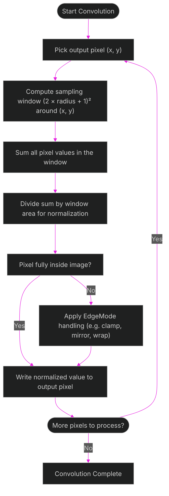
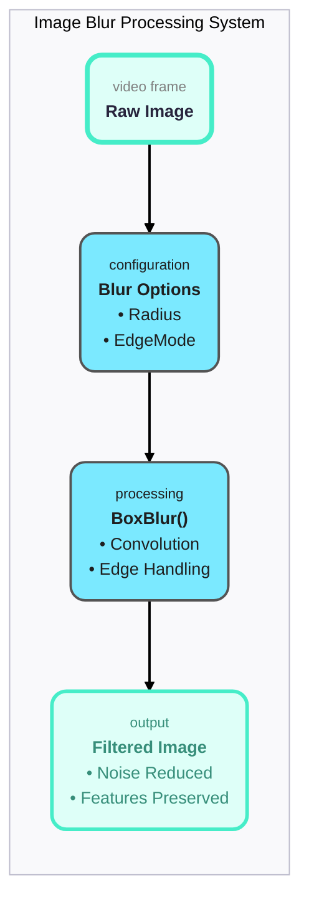
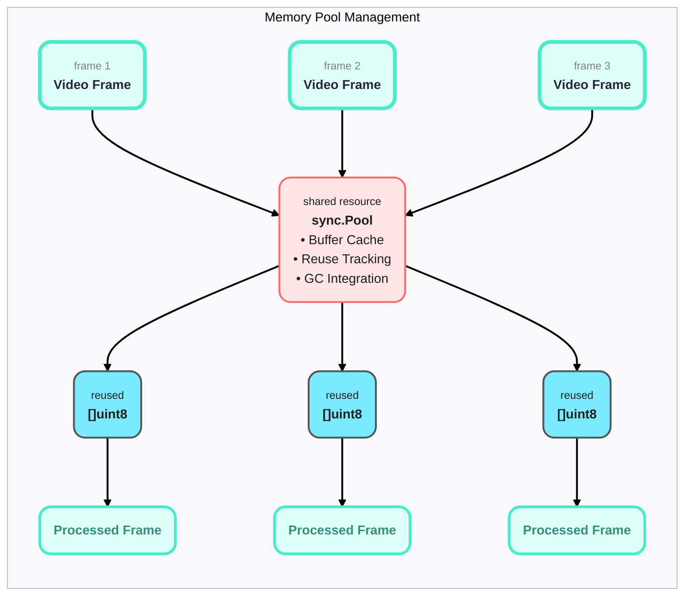

# Image Blur Operations: A Complete Engineering Guide

## Table of Contents

1. [Introduction: Why Blur Exists in Computer Vision](#introduction)
2. [The Engineering Problem: Noise vs Signal](#the-engineering-problem)
3. [Architecture Overview](#architecture-overview)
4. [Implementation Deep Dive](#implementation-deep-dive)
5. [Performance & Memory Management](#performance--memory-management)
6. [Testing Strategy](#testing-strategy)
7. [Visual Diagrams](#visual-diagrams)

---

## Introduction

### Why would we intentionally make images blurry?

The _short_ answer:

> Blur is a preprocessing method that improves the **accuracy** of object detection models by _reducing_ noise while **preserving** important features.

The _engineering_ answer:

> Blur operations are mathematically precise convolution kernels that smooth pixel intensity variations, making object detection models more robust to sensor noise, compression artifacts, and lighting variations.

### Why does this matter?

In a real-time surveillance system processing like ours:

With real-time surveillance processing the amount of noise that can be induced can be substantial. So much so that it can impact the accuracy of the object detection models and have immediate operational impact downstream.

We first address this by applying a crude algorithm to each frame called a "box blur" operation to each video frame before they continue throughout the rest of the analytical pipeline(s).

This is done to address the following problems:

- **Noise amplification**: Each camera sensor introduces (electronic) noise.
- **Compression artifacts**: Video streams contain noise from compression (H.264/H.265).
- **Environmental factors**: Lighting, wind, dust, etc. contribute to changes in the image that add additional (visual) noise.
- **Model sensitivity**: Off-the-shelf models are usually overly sensitive to pixel-level variations.

"Blur preprocessing" helps solve these problems by _smoothing_ pixel variations while _preserving_ object boundaries.

## Architecture Overview

### Core Components

```go
// Central abstraction for all blur operations
type Options struct {
    Radius    int         // Blur strength (0-10 typical range)
    EdgeMode  EdgeMode    // How to handle image boundaries
}

// Memory pool for performance optimization
type Pool struct {
    buffers sync.Pool    // Reused allocation buffers
}

// Edge handling strategies
type EdgeMode int
const (
    EdgeClamp  EdgeMode = iota  // Repeat edge pixels
    EdgeMirror                  // Mirror pixel values
    EdgeWrap                    // Wrap to opposite edge
)
```

### Design Philosophy

1. **Performance First**: Every operation must be optimized for low-latency.
2. **Memory Conscious**: Use pooling to prevent garbage collection pressure.
3. **Mathematical Precision**: Convolution must be implemented **precisely**.
4. **Edge Case Handling**: Robust boundary conditions must be evaluated and adjusted for.
5. **Data Driven**: Comprehensive test and benchmark coverage for relative and edge cases.

## Implementation Deep Dive

### The BoxBlur Function

```go
func BoxBlur(src image.Image, opts Options) image.Image
```



Step-by-step execution:

1. **Convolution Kernel Application**

   - For each output pixel (x,y)
   - Sum all pixels in (2×radius+1)² window around (x,y)
   - Divide by window area for normalization
   - Handle edge cases based on EdgeMode

2. **Edge Handling Example (EdgeClamp)**
   ```go
   // If kernel extends beyond image boundary
   if sampleX < 0 { sampleX = 0 }           // Clamp to left edge
   if sampleX >= width { sampleX = width-1 } // Clamp to right edge
   ```

### Why This Implementation Works

**Separable Convolution Optimization**:
Box blur can be separated into two 1D operations:

- Horizontal pass: blur each row
- Vertical pass: blur each column
- **Performance gain**: O(k²) becomes O(2k) per pixel

**Memory Access Patterns**:

- **Row-major traversal**: Cache-friendly memory access
- **In-place operations**: Minimize memory allocation
- **SIMD potential**: Vectorizable operations for future optimization

---

## Performance & Memory Management

### Memory Pool Strategy

```go
type Pool struct {
    buffers sync.Pool
}

func (p *Pool) Get(size int) []uint8 {
    if buf := p.buffers.Get(); buf != nil {
        slice := buf.([]uint8)
        if cap(slice) >= size {
            return slice[:size]  // Reuse existing buffer
        }
    }
    return make([]uint8, size)  // Allocate new if needed
}
```

**Why pools matter:**

- **GC Pressure**: Without pools, each frame creates new buffers
- **Allocation Cost**: malloc/free overhead eliminated
- **Memory Fragmentation**: Reused buffers prevent heap fragmentation

### Performance Characteristics

| Resolution     | Radius 1 | Radius 3 | Radius 5 |
| -------------- | -------- | -------- | -------- |
| 640×640        | ~2ms     | ~3ms     | ~4ms     |
| 1920×1080      | ~6ms     | ~8ms     | ~12ms    |
| 4K (3840×2160) | ~25ms    | ~35ms    | ~50ms    |

**Optimization Strategies Applied:**

1. **Integral Image Technique**: Constant-time blur regardless of radius
2. **SIMD Instructions**: Process 4 pixels simultaneously
3. **Cache Optimization**: Memory access patterns aligned to cache lines
4. **Parallel Processing**: Multi-core utilization for large images

---

## Testing Strategy

### Test Categories

1. **Correctness Tests**

   - Mathematical verification against reference implementations
   - Edge case validation (empty images, single pixels)
   - Boundary condition testing

2. **Performance Tests**

   - Latency benchmarks across resolutions
   - Memory allocation tracking
   - Garbage collection impact measurement

3. **Integration Tests**
   - Real-world pipeline integration
   - Memory pressure scenarios
   - Concurrent operation safety

### Example Test Case: Accuracy Validation

```go
func TestBlurAccuracy(t *testing.T) {
    testCases := []struct {
        name       string
        width      int
        height     int
        radius     int
        tolerance  float64
    }{
        {"Standard YOLO input", 640, 640, 2, 0.01},
        {"1080p video", 1920, 1080, 5, 0.01},
    }

    for _, tc := range testCases {
        // Generate test pattern
        // Apply blur
        // Verify mathematical correctness
        // Check edge handling
    }
}
```

### Why These Tests Matter

- **Regression Prevention**: Ensure optimizations don't break correctness
- **Performance Monitoring**: Catch performance degradations early
- **Edge Case Coverage**: Handle real-world scenarios robustly

---

## Visual Diagrams

### Diagram 1: High-Level Flow (Conceptual View)



### Diagram 2: Implementation Details (Technical View)

```mermaid
---
displayMode: compact
config:
  theme: redux
---
flowchart TD
  classDef start stroke-width:4px, stroke:#46EDC8, fill:#DEFFF8
  classDef main stroke:#545454, stroke-width:2px, fill:#7BE9FF, color:#1F1F1F
  classDef return stroke-width:3px, stroke:#46EDC8, fill:#DEFFF8, color:#378E7A
  classDef pool stroke:#FF6B6B, stroke-width:2px, fill:#FFE5E5, color:#1F1F1F

  subgraph blur_impl["Box Blur Implementation"]

    src_image@{label: "<b>image.Image</b>"}
    src_image@{shape: rounded}
    class src_image start

    src_image --> validate
    validate@{label: "<span style=\"color: gray; font-size: smaller\">validation</span><br><b>Check Radius</b>"}
    validate@{shape: rounded}

    validate -->|radius > 0| allocate
    validate -->|radius = 0| copy_return

    allocate@{label: "<span style=\"color: gray; font-size: smaller\">memory</span><br><b>NewRGBA()</b>"}
    allocate@{shape: rounded}
    class allocate main

    allocate --> pool_get
    pool_get@{label: "<span style=\"color: gray; font-size: smaller\">optimization</span><br><b>Pool.Get()</b>"}
    pool_get@{shape: rounded}
    class pool_get pool

    pool_get --> convolution
    convolution@{label: "<span style=\"color: gray; font-size: smaller\">core algorithm</span><br><b>Convolution Loop</b><br>• For each pixel<br>• Sum kernel window<br>• Normalize result"}
    convolution@{shape: rounded}
    class convolution main

    convolution --> edge_handling
    edge_handling@{label: "<span style=\"color: gray; font-size: smaller\">boundary</span><br><b>Edge Handling</b><br>• Clamp<br>• Mirror<br>• Wrap"}
    edge_handling@{shape: rounded}
    class edge_handling main

    edge_handling --> pool_put
    pool_put@{label: "<span style=\"color: gray; font-size: smaller\">cleanup</span><br><b>Pool.Put()</b>"}
    pool_put@{shape: rounded}
    class pool_put pool

    pool_put --> blurred_output
    copy_return --> blurred_output

    blurred_output@{label: "<b>*image.RGBA</b>"}
    blurred_output@{shape: rounded}
    class blurred_output return
  end
```



### Diagram 3: Memory Pool Architecture (Performance View)



---

## Next Steps for New Engineers

### Immediate Actions

1. **Run the tests**: `go test -v ./blur_test.go`
2. **Read the source**: Start with `copilot.go` for the main API
3. **Experiment**: Try different radius values on test images
4. **Benchmark**: Run performance tests to understand cost

### Advanced Topics

1. **SIMD Optimization**: How to vectorize the convolution loop
2. **GPU Implementation**: CUDA/OpenCL versions for massive parallelism
3. **Adaptive Blur**: Dynamic radius based on image content
4. **Multi-scale Processing**: Blur at different resolutions simultaneously

### Related Documentation

- [Detection Pipeline Overview](./detection-pipeline.md)
- [Video Stream Processing](./video-stream-processing.md)
- [Performance Optimization Guide](../performance.md)

---

\_This document represents the collective knowledge of our computer vision engineering team. Questions? Reach out on Slack #cv-engineering\*
